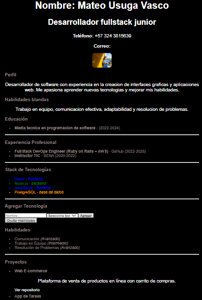

# React + Vite

This template provides a minimal setup to get React working in Vite with HMR and some ESLint rules.

Currently, two official plugins are available:

- [@vitejs/plugin-react](https://github.com/vitejs/vite-plugin-react/blob/main/packages/plugin-react) uses [Babel](https://babeljs.io/) for Fast Refresh
- [@vitejs/plugin-react-swc](https://github.com/vitejs/vite-plugin-react/blob/main/packages/plugin-react-swc) uses [SWC](https://swc.rs/) for Fast Refresh

## Expanding the ESLint configuration

If you are developing a production application, we recommend using TypeScript with type-aware lint rules enabled. Check out the [TS template](https://github.com/vitejs/vite/tree/main/packages/create-vite/template-react-ts) for information on how to integrate TypeScript and [`typescript-eslint`](https://typescript-eslint.io) in your project.

nombre del proyecto: MI-APP-REACT

imagen de la pagina: 

instrucciones: 
Para iniciar el proyecto ejecutar en la terminal usar, "npm install" y "npm start dev" y seleccionar el link que se deja despues de la ejecucion del comando.

Explicacion del uso de props:
Los props o propiedades funcionan como bloques de codigo facilmente reutilizables para cualquier parte de la pagina, estos siendo transmitidos de componentes padres a componentes hijo, y como funcionan como bloques de codigo en donde se pueden introducir cualquier dato que queramos pasar por las paginas, son altamente versatiles y faciles de transmitir entre componentes en donde se necesite.

Funciones añadidas: Ahora la hoja de vida permite añadir recnologias en esta misma, y puede mostrar y ocultar secciones especificas.

